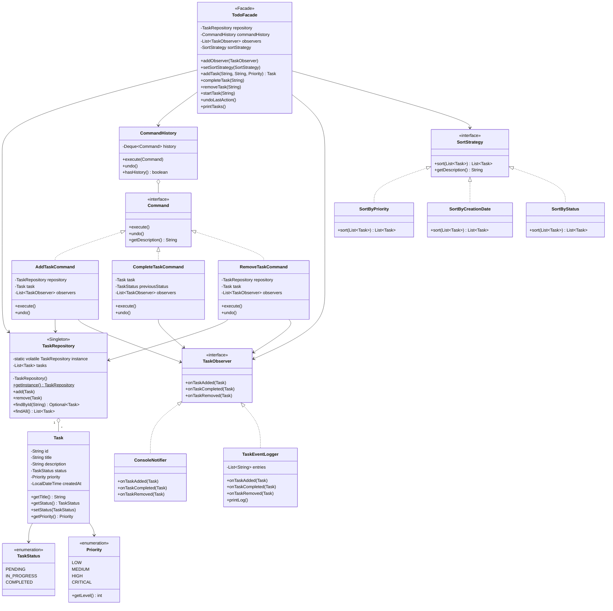

# ToDo List — Padrões de Projetos de Software

**Disciplina:** Padrões de Projetos de Software  
**Grupo:** Enzo Shimada Daun (840552) · Miguel Ribas Berlese (839938) · Mateus Ávila - (839015)

---

## 1. Tema Escolhido

Aplicativo de tarefas (**ToDo List**) em Java puro, sem frameworks externos.  
O sistema permite criar, iniciar, concluir e remover tarefas, ordenar a lista por diferentes critérios e desfazer qualquer operação (undo), com notificação automática de eventos via observers.

---

## 2. Arquitetura Geral

O projeto adota uma arquitetura em **camadas de responsabilidade**, onde cada pacote encapsula exatamente uma preocupação:

```
com.todolist
├── model       → Entidades de domínio (Task, TaskStatus, Priority)
├── repository  → Persistência em memória — padrão Singleton
├── observer    → Notificações de eventos — padrão Observer
├── command     → Operações reversíveis — padrão Command
├── strategy    → Algoritmos de ordenação — padrão Strategy
├── facade      → API simplificada — padrão Facade
└── Main.java   → Demonstração integrada
```

O fluxo central de uma operação é:

```
Main → TodoFacade → CommandHistory → Command concreto
                                         ↓
                                  TaskRepository (Singleton)
                                         ↓
                               TaskObserver[] (notifica todos)
```

A lista é exibida pela `TodoFacade` que delega para a `SortStrategy` ativa — trocável em tempo de execução.

---

## 3. Padrões Aplicados

### 3.1 Singleton — `TaskRepository`

**Onde:** `com.todolist.repository.TaskRepository`

**Como:** O construtor é privado. O acesso se dá exclusivamente por `TaskRepository.getInstance()`, implementado com *double-checked locking* e campo `volatile` para segurança em ambientes multi-thread.

```java
private static volatile TaskRepository instance;

public static TaskRepository getInstance() {
    if (instance == null) {
        synchronized (TaskRepository.class) {
            if (instance == null) {
                instance = new TaskRepository();
            }
        }
    }
    return instance;
}
```

**Por quê:** Um ToDo List possui exatamente um conjunto de tarefas. O Singleton garante que `TodoFacade`, `AddTaskCommand`, `RemoveTaskCommand` e demais componentes sempre acessem o **mesmo** armazenamento, eliminando inconsistências de estado. Sem esse padrão, cada componente poderia criar sua própria lista, resultando em dados duplicados ou perdidos.

---

### 3.2 Observer — `TaskObserver`

**Onde:** Interface `com.todolist.observer.TaskObserver`; implementações: `ConsoleNotifier`, `TaskEventLogger`

**Como:** A `TodoFacade` mantém uma `List<TaskObserver>`. Cada operação que altera o estado de uma tarefa notifica todos os observadores registrados chamando o método de evento correspondente (`onTaskAdded`, `onTaskCompleted`, `onTaskRemoved`).

```java
// Registro de observadores
todo.addObserver(new ConsoleNotifier());
        todo.addObserver(new TaskEventLogger());

// Notificação automática dentro do Command
        observers.forEach(o -> o.onTaskAdded(task));
```

**Por quê:** Desacopla completamente o núcleo da aplicação das reações a eventos. Um novo observador (ex: envio de e-mail, notificação push, integração com banco de dados) pode ser adicionado **sem modificar nenhuma classe existente** — respeita o princípio Open/Closed (OCP). Os dois observadores concretos têm responsabilidades distintas: `ConsoleNotifier` exibe mensagens ao usuário; `TaskEventLogger` mantém um log de auditoria.

---

### 3.3 Command — `Command` + `CommandHistory`

**Onde:** Interface `com.todolist.command.Command`; concretos: `AddTaskCommand`, `CompleteTaskCommand`, `RemoveTaskCommand`; orquestrador: `CommandHistory`

**Como:** Cada operação sobre tarefas é encapsulada em um objeto `Command` com `execute()` e `undo()`. O `CommandHistory` empilha os comandos executados (usando `ArrayDeque` como pilha LIFO). A chamada `undoLastAction()` desempilha e inverte a última operação.

```java
// CompleteTaskCommand captura o estado ANTES de executar
public CompleteTaskCommand(Task task, List<TaskObserver> observers) {
    this.previousStatus = task.getStatus(); // snapshot
    ...
}

@Override
public void undo() {
    task.setStatus(previousStatus); // restaura
}
```

**Por quê:** Desacopla *quem invoca* uma operação de *como ela é executada*, e habilita **undo/redo** sem que o código cliente precise conhecer os detalhes de cada operação. Seguindo o DIP, `CommandHistory` depende somente da abstração `Command`, não de nenhuma implementação concreta. Adicionar um novo comando (ex: `EditTaskCommand`) não exige nenhuma mudança em `CommandHistory` ou `TodoFacade`.

---

### 3.4 Strategy — `SortStrategy`

**Onde:** Interface `com.todolist.strategy.SortStrategy`; concretas: `SortByPriority`, `SortByCreationDate`, `SortByStatus`

**Como:** A `TodoFacade` guarda uma referência ao tipo `SortStrategy`. O método `setSortStrategy()` permite trocar o algoritmo em tempo de execução. Cada estratégia recebe a lista e retorna uma **nova** lista ordenada, sem modificar a original.

```java
// Troca de estratégia em runtime
todo.setSortStrategy(new SortByStatus());
        todo.printTasks(); // usa o novo algoritmo imediatamente

todo.setSortStrategy(new SortByPriority());
        todo.printTasks(); // troca novamente, sem alterar nenhum estado
```

**Por quê:** Elimina cadeias de `if/else` ou `switch` para decidir como ordenar. Cada algoritmo fica isolado na sua própria classe, facilitando testes unitários. Novos critérios de ordenação (ex: por data de vencimento) são adicionados criando uma nova classe que implementa `SortStrategy` — sem tocar no código existente (OCP).

---

### 3.5 Facade — `TodoFacade` *(padrão bônus)*

**Onde:** `com.todolist.facade.TodoFacade`

**Como:** Centraliza e orquestra todos os subsistemas. O código cliente (`Main.java`) interage **exclusivamente** com a `TodoFacade`, sem conhecer `TaskRepository`, `CommandHistory`, `List<TaskObserver>` ou `SortStrategy` internamente.

```java
// Main.java — interface simples, subsistemas invisíveis
TodoFacade todo = new TodoFacade(new SortByPriority());
todo.addObserver(notifier);
Task t = todo.addTask("Estudar Design Patterns", "...", Priority.HIGH);
todo.completeTask(t.getId());
        todo.undoLastAction();
todo.printTasks();
```

**Por quê:** Sem a Facade, o `Main` precisaria instanciar e coordenar manualmente `TaskRepository`, `CommandHistory`, observadores e estratégias — alta complexidade acidental. A Facade reduz o acoplamento e apresenta uma API coesa e intuitiva para o cliente.

---

## 4. Princípios SOLID Aplicados

| Princípio | Aplicação no projeto |
|-----------|----------------------|
| **S** — Single Responsibility | Cada classe tem uma única razão para mudar: `Task` modela dados; `TaskRepository` persiste; `CommandHistory` gerencia o histórico; cada `Command` encapsula uma operação. |
| **O** — Open/Closed | Novos observers, commands e strategies são adicionados criando novas classes, sem modificar as existentes. |
| **L** — Liskov Substitution | `SortByPriority`, `SortByStatus` e `SortByCreationDate` são substituíveis entre si em qualquer ponto que aceite `SortStrategy`. O mesmo vale para os observers e commands. |
| **I** — Interface Segregation | Interfaces pequenas e focadas: `Command` (3 métodos), `TaskObserver` (3 métodos), `SortStrategy` (2 métodos). Nenhum implementador é forçado a implementar métodos desnecessários. |
| **D** — Dependency Inversion | `TodoFacade` e `CommandHistory` dependem das abstrações `Command`, `TaskObserver` e `SortStrategy` — nunca de implementações concretas. |

---

## 5. Diagrama de Classes (UML simplificado)

![Diagrama de Classes UML](https://mermaid.ink/img/Y2xhc3NEaWFncmFtCgogICAgJSUg4pSA4pSAIE1PREVMIOKUgOKUgOKUgOKUgOKUgOKUgOKUgOKUgOKUgOKUgOKUgOKUgOKUgOKUgOKUgOKUgOKUgOKUgOKUgOKUgOKUgOKUgOKUgOKUgOKUgOKUgOKUgOKUgOKUgOKUgOKUgOKUgOKUgOKUgOKUgOKUgOKUgOKUgOKUgOKUgOKUgOKUgOKUgOKUgOKUgOKUgOKUgOKUgOKUgOKUgOKUgOKUgOKUgOKUgAogICAgY2xhc3MgVGFzayB7CiAgICAgICAgLVN0cmluZyBpZAogICAgICAgIC1TdHJpbmcgdGl0bGUKICAgICAgICAtU3RyaW5nIGRlc2NyaXB0aW9uCiAgICAgICAgLVRhc2tTdGF0dXMgc3RhdHVzCiAgICAgICAgLVByaW9yaXR5IHByaW9yaXR5CiAgICAgICAgLUxvY2FsRGF0ZVRpbWUgY3JlYXRlZEF0CiAgICAgICAgK2dldFRpdGxlKCkgU3RyaW5nCiAgICAgICAgK2dldFN0YXR1cygpIFRhc2tTdGF0dXMKICAgICAgICArc2V0U3RhdHVzKFRhc2tTdGF0dXMpCiAgICAgICAgK2dldFByaW9yaXR5KCkgUHJpb3JpdHkKICAgIH0KCiAgICBjbGFzcyBUYXNrU3RhdHVzIHsKICAgICAgICA8PGVudW1lcmF0aW9uPj4KICAgICAgICBQRU5ESU5HCiAgICAgICAgSU5fUFJPR1JFU1MKICAgICAgICBDT01QTEVURUQKICAgIH0KCiAgICBjbGFzcyBQcmlvcml0eSB7CiAgICAgICAgPDxlbnVtZXJhdGlvbj4-CiAgICAgICAgTE9XCiAgICAgICAgTUVESVVNCiAgICAgICAgSElHSAogICAgICAgIENSSVRJQ0FMCiAgICAgICAgK2dldExldmVsKCkgaW50CiAgICB9CgogICAgVGFzayAtLT4gVGFza1N0YXR1cwogICAgVGFzayAtLT4gUHJpb3JpdHkKCiAgICAlJSDilIDilIAgU0lOR0xFVE9OIOKUgOKUgOKUgOKUgOKUgOKUgOKUgOKUgOKUgOKUgOKUgOKUgOKUgOKUgOKUgOKUgOKUgOKUgOKUgOKUgOKUgOKUgOKUgOKUgOKUgOKUgOKUgOKUgOKUgOKUgOKUgOKUgOKUgOKUgOKUgOKUgOKUgOKUgOKUgOKUgOKUgOKUgOKUgOKUgOKUgOKUgOKUgOKUgOKUgOKUgOKUgAogICAgY2xhc3MgVGFza1JlcG9zaXRvcnkgewogICAgICAgIDw8U2luZ2xldG9uPj4KICAgICAgICAtc3RhdGljIHZvbGF0aWxlIFRhc2tSZXBvc2l0b3J5IGluc3RhbmNlCiAgICAgICAgLUxpc3R-VGFza34gdGFza3MKICAgICAgICAtVGFza1JlcG9zaXRvcnkoKQogICAgICAgICtnZXRJbnN0YW5jZSgpJCBUYXNrUmVwb3NpdG9yeQogICAgICAgICthZGQoVGFzaykKICAgICAgICArcmVtb3ZlKFRhc2spCiAgICAgICAgK2ZpbmRCeUlkKFN0cmluZykgT3B0aW9uYWx-VGFza34KICAgICAgICArZmluZEFsbCgpIExpc3R-VGFza34KICAgIH0KCiAgICBUYXNrUmVwb3NpdG9yeSAiMSIgby0tICIqIiBUYXNrCgogICAgJSUg4pSA4pSAIE9CU0VSVkVSIOKUgOKUgOKUgOKUgOKUgOKUgOKUgOKUgOKUgOKUgOKUgOKUgOKUgOKUgOKUgOKUgOKUgOKUgOKUgOKUgOKUgOKUgOKUgOKUgOKUgOKUgOKUgOKUgOKUgOKUgOKUgOKUgOKUgOKUgOKUgOKUgOKUgOKUgOKUgOKUgOKUgOKUgOKUgOKUgOKUgOKUgOKUgOKUgOKUgOKUgOKUgOKUgAogICAgY2xhc3MgVGFza09ic2VydmVyIHsKICAgICAgICA8PGludGVyZmFjZT4-CiAgICAgICAgK29uVGFza0FkZGVkKFRhc2spCiAgICAgICAgK29uVGFza0NvbXBsZXRlZChUYXNrKQogICAgICAgICtvblRhc2tSZW1vdmVkKFRhc2spCiAgICB9CgogICAgY2xhc3MgQ29uc29sZU5vdGlmaWVyIHsKICAgICAgICArb25UYXNrQWRkZWQoVGFzaykKICAgICAgICArb25UYXNrQ29tcGxldGVkKFRhc2spCiAgICAgICAgK29uVGFza1JlbW92ZWQoVGFzaykKICAgIH0KCiAgICBjbGFzcyBUYXNrRXZlbnRMb2dnZXIgewogICAgICAgIC1MaXN0flN0cmluZ34gZW50cmllcwogICAgICAgICtvblRhc2tBZGRlZChUYXNrKQogICAgICAgICtvblRhc2tDb21wbGV0ZWQoVGFzaykKICAgICAgICArb25UYXNrUmVtb3ZlZChUYXNrKQogICAgICAgICtwcmludExvZygpCiAgICB9CgogICAgVGFza09ic2VydmVyIDx8Li4gQ29uc29sZU5vdGlmaWVyCiAgICBUYXNrT2JzZXJ2ZXIgPHwuLiBUYXNrRXZlbnRMb2dnZXIKCiAgICAlJSDilIDilIAgQ09NTUFORCDilIDilIDilIDilIDilIDilIDilIDilIDilIDilIDilIDilIDilIDilIDilIDilIDilIDilIDilIDilIDilIDilIDilIDilIDilIDilIDilIDilIDilIDilIDilIDilIDilIDilIDilIDilIDilIDilIDilIDilIDilIDilIDilIDilIDilIDilIDilIDilIDilIDilIDilIDilIDilIAKICAgIGNsYXNzIENvbW1hbmQgewogICAgICAgIDw8aW50ZXJmYWNlPj4KICAgICAgICArZXhlY3V0ZSgpCiAgICAgICAgK3VuZG8oKQogICAgICAgICtnZXREZXNjcmlwdGlvbigpIFN0cmluZwogICAgfQoKICAgIGNsYXNzIEFkZFRhc2tDb21tYW5kIHsKICAgICAgICAtVGFza1JlcG9zaXRvcnkgcmVwb3NpdG9yeQogICAgICAgIC1UYXNrIHRhc2sKICAgICAgICAtTGlzdH5UYXNrT2JzZXJ2ZXJ-IG9ic2VydmVycwogICAgICAgICtleGVjdXRlKCkKICAgICAgICArdW5kbygpCiAgICB9CgogICAgY2xhc3MgQ29tcGxldGVUYXNrQ29tbWFuZCB7CiAgICAgICAgLVRhc2sgdGFzawogICAgICAgIC1UYXNrU3RhdHVzIHByZXZpb3VzU3RhdHVzCiAgICAgICAgLUxpc3R-VGFza09ic2VydmVyfiBvYnNlcnZlcnMKICAgICAgICArZXhlY3V0ZSgpCiAgICAgICAgK3VuZG8oKQogICAgfQoKICAgIGNsYXNzIFJlbW92ZVRhc2tDb21tYW5kIHsKICAgICAgICAtVGFza1JlcG9zaXRvcnkgcmVwb3NpdG9yeQogICAgICAgIC1UYXNrIHRhc2sKICAgICAgICAtTGlzdH5UYXNrT2JzZXJ2ZXJ-IG9ic2VydmVycwogICAgICAgICtleGVjdXRlKCkKICAgICAgICArdW5kbygpCiAgICB9CgogICAgY2xhc3MgQ29tbWFuZEhpc3RvcnkgewogICAgICAgIC1EZXF1ZX5Db21tYW5kfiBoaXN0b3J5CiAgICAgICAgK2V4ZWN1dGUoQ29tbWFuZCkKICAgICAgICArdW5kbygpCiAgICAgICAgK2hhc0hpc3RvcnkoKSBib29sZWFuCiAgICB9CgogICAgQ29tbWFuZCA8fC4uIEFkZFRhc2tDb21tYW5kCiAgICBDb21tYW5kIDx8Li4gQ29tcGxldGVUYXNrQ29tbWFuZAogICAgQ29tbWFuZCA8fC4uIFJlbW92ZVRhc2tDb21tYW5kCiAgICBDb21tYW5kSGlzdG9yeSBvLS0gQ29tbWFuZAoKICAgICUlIOKUgOKUgCBTVFJBVEVHWSDilIDilIDilIDilIDilIDilIDilIDilIDilIDilIDilIDilIDilIDilIDilIDilIDilIDilIDilIDilIDilIDilIDilIDilIDilIDilIDilIDilIDilIDilIDilIDilIDilIDilIDilIDilIDilIDilIDilIDilIDilIDilIDilIDilIDilIDilIDilIDilIDilIDilIDilIDilIAKICAgIGNsYXNzIFNvcnRTdHJhdGVneSB7CiAgICAgICAgPDxpbnRlcmZhY2U-PgogICAgICAgICtzb3J0KExpc3R-VGFza34pIExpc3R-VGFza34KICAgICAgICArZ2V0RGVzY3JpcHRpb24oKSBTdHJpbmcKICAgIH0KCiAgICBjbGFzcyBTb3J0QnlQcmlvcml0eSB7CiAgICAgICAgK3NvcnQoTGlzdH5UYXNrfikgTGlzdH5UYXNrfgogICAgfQoKICAgIGNsYXNzIFNvcnRCeUNyZWF0aW9uRGF0ZSB7CiAgICAgICAgK3NvcnQoTGlzdH5UYXNrfikgTGlzdH5UYXNrfgogICAgfQoKICAgIGNsYXNzIFNvcnRCeVN0YXR1cyB7CiAgICAgICAgK3NvcnQoTGlzdH5UYXNrfikgTGlzdH5UYXNrfgogICAgfQoKICAgIFNvcnRTdHJhdGVneSA8fC4uIFNvcnRCeVByaW9yaXR5CiAgICBTb3J0U3RyYXRlZ3kgPHwuLiBTb3J0QnlDcmVhdGlvbkRhdGUKICAgIFNvcnRTdHJhdGVneSA8fC4uIFNvcnRCeVN0YXR1cwoKICAgICUlIOKUgOKUgCBGQUNBREUg4pSA4pSA4pSA4pSA4pSA4pSA4pSA4pSA4pSA4pSA4pSA4pSA4pSA4pSA4pSA4pSA4pSA4pSA4pSA4pSA4pSA4pSA4pSA4pSA4pSA4pSA4pSA4pSA4pSA4pSA4pSA4pSA4pSA4pSA4pSA4pSA4pSA4pSA4pSA4pSA4pSA4pSA4pSA4pSA4pSA4pSA4pSA4pSA4pSA4pSA4pSA4pSA4pSA4pSACiAgICBjbGFzcyBUb2RvRmFjYWRlIHsKICAgICAgICA8PEZhY2FkZT4-CiAgICAgICAgLVRhc2tSZXBvc2l0b3J5IHJlcG9zaXRvcnkKICAgICAgICAtQ29tbWFuZEhpc3RvcnkgY29tbWFuZEhpc3RvcnkKICAgICAgICAtTGlzdH5UYXNrT2JzZXJ2ZXJ-IG9ic2VydmVycwogICAgICAgIC1Tb3J0U3RyYXRlZ3kgc29ydFN0cmF0ZWd5CiAgICAgICAgK2FkZE9ic2VydmVyKFRhc2tPYnNlcnZlcikKICAgICAgICArc2V0U29ydFN0cmF0ZWd5KFNvcnRTdHJhdGVneSkKICAgICAgICArYWRkVGFzayhTdHJpbmcsIFN0cmluZywgUHJpb3JpdHkpIFRhc2sKICAgICAgICArY29tcGxldGVUYXNrKFN0cmluZykKICAgICAgICArcmVtb3ZlVGFzayhTdHJpbmcpCiAgICAgICAgK3N0YXJ0VGFzayhTdHJpbmcpCiAgICAgICAgK3VuZG9MYXN0QWN0aW9uKCkKICAgICAgICArcHJpbnRUYXNrcygpCiAgICB9CgogICAgVG9kb0ZhY2FkZSAtLT4gVGFza1JlcG9zaXRvcnkKICAgIFRvZG9GYWNhZGUgLS0-IENvbW1hbmRIaXN0b3J5CiAgICBUb2RvRmFjYWRlIC0tPiBUYXNrT2JzZXJ2ZXIKICAgIFRvZG9GYWNhZGUgLS0-IFNvcnRTdHJhdGVneQogICAgQWRkVGFza0NvbW1hbmQgLS0-IFRhc2tSZXBvc2l0b3J5CiAgICBBZGRUYXNrQ29tbWFuZCAtLT4gVGFza09ic2VydmVyCiAgICBDb21wbGV0ZVRhc2tDb21tYW5kIC0tPiBUYXNrT2JzZXJ2ZXIKICAgIFJlbW92ZVRhc2tDb21tYW5kIC0tPiBUYXNrUmVwb3NpdG9yeQogICAgUmVtb3ZlVGFza0NvbW1hbmQgLS0-IFRhc2tPYnNlcnZlcgo=)

> *Se a imagem não carregar, verifique sua conexão com a internet ou visualize o README no GitHub.*

<details>
<summary>Código-fonte Mermaid do diagrama</summary>



</details>

---

## 6. Como Executar

```bash
# Compilar (a partir da raiz do projeto)
javac -d out $(find src -name "*.java")

# Executar
java -cp out com.todolist.Main
```

**Saída esperada (trecho):**
```
╔══════════════════════════════════════════════════════╗
║         ToDo List — Design Patterns                  ║
║  Padroes: Singleton, Observer, Command, Strategy     ║
╠══════════════════════════════════════════════════════╣
║  Enzo Shimada Daun        (840552)                   ║
║  Miguel Ribas Berlese     (839938)                   ║
║  Mateus Avila             (839015)                   ║
╚══════════════════════════════════════════════════════╝

>>> ADICIONANDO TAREFAS

[CMD] Adicionar tarefa: "Estudar Design Patterns"
[NOTIFICACAO] Nova tarefa adicionada: "Estudar Design Patterns" (Prioridade: Alta)
...
[STRATEGY] Estrategia alterada para: Status (Pendente -> Em Progresso -> Concluida)
...
[UNDO] Conclusao desfeita — "Estudar Design Patterns" voltou para: Em Progresso
```

---

## 7. Estrutura de Arquivos

```
todo-list/
├── README.md
└── src/
    └── main/
        └── java/
            └── com/
                └── todolist/
                    ├── Main.java
                    ├── model/
                    │   ├── Task.java
                    │   ├── TaskStatus.java
                    │   └── Priority.java
                    ├── repository/
                    │   └── TaskRepository.java       ← Singleton
                    ├── observer/
                    │   ├── TaskObserver.java          ← interface
                    │   ├── ConsoleNotifier.java
                    │   └── TaskEventLogger.java
                    ├── command/
                    │   ├── Command.java               ← interface
                    │   ├── AddTaskCommand.java
                    │   ├── CompleteTaskCommand.java
                    │   ├── RemoveTaskCommand.java
                    │   └── CommandHistory.java
                    ├── strategy/
                    │   ├── SortStrategy.java          ← interface
                    │   ├── SortByPriority.java
                    │   ├── SortByCreationDate.java
                    │   └── SortByStatus.java
                    └── facade/
                        └── TodoFacade.java            ← Facade
```

---

## 8. Considerações Finais

O projeto demonstra como padrões de projeto distintos colaboram naturalmente em uma aplicação real, sem forçar encaixes artificiais:

- O **Singleton** resolve o problema concreto de compartilhamento de estado entre componentes que precisam acessar a mesma lista de tarefas.
- O **Observer** torna o sistema extensível a novas formas de reagir a eventos (logs, e-mails, UIs) sem alterar o núcleo.
- O **Command** não apenas desacopla operações de sua invocação, como entrega uma funcionalidade valiosa para o usuário: o undo, implementado com poucas linhas graças ao encapsulamento do estado anterior em cada comando.
- O **Strategy** elimina condicionais para ordenação e torna trivial adicionar novos critérios no futuro.
- O **Facade** é a cola que une tudo: o código cliente (`Main.java`) fica limpo e legível, interagindo com uma única interface de alto nível.

Todos os cinco princípios SOLID estão presentes de forma orgânica: cada classe tem uma única responsabilidade, o sistema é aberto para extensão mas fechado para modificação, as abstrações (interfaces) governam as dependências, e as implementações concretas são substituíveis entre si. O resultado é um codebase onde adicionar um novo padrão de notificação, um novo critério de ordenação ou um novo tipo de comando não requer mudança em nenhuma classe existente.
